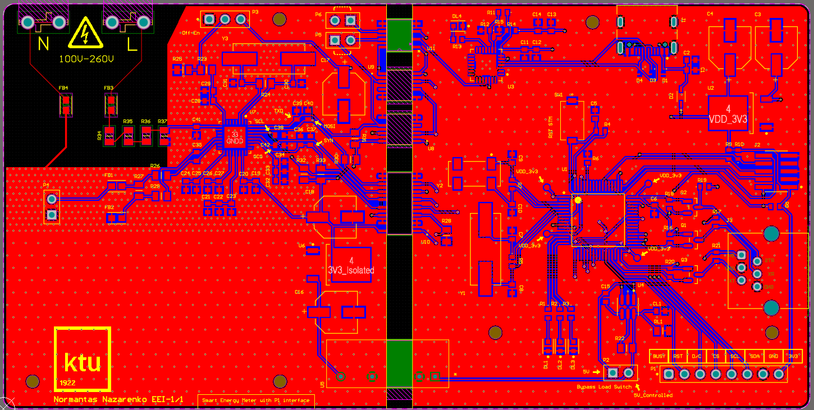
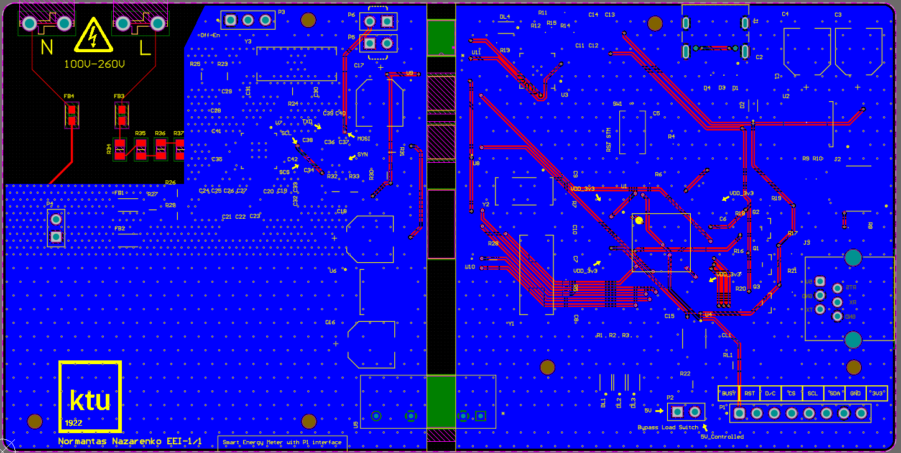
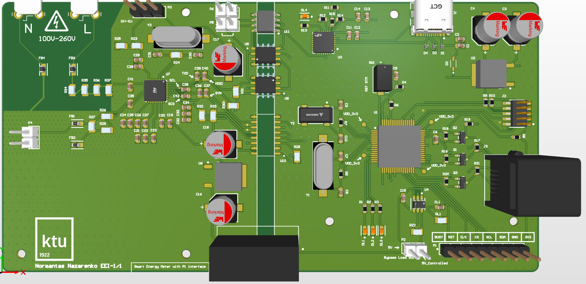
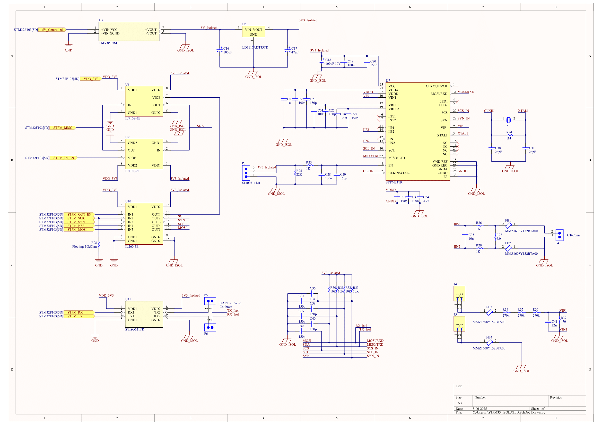
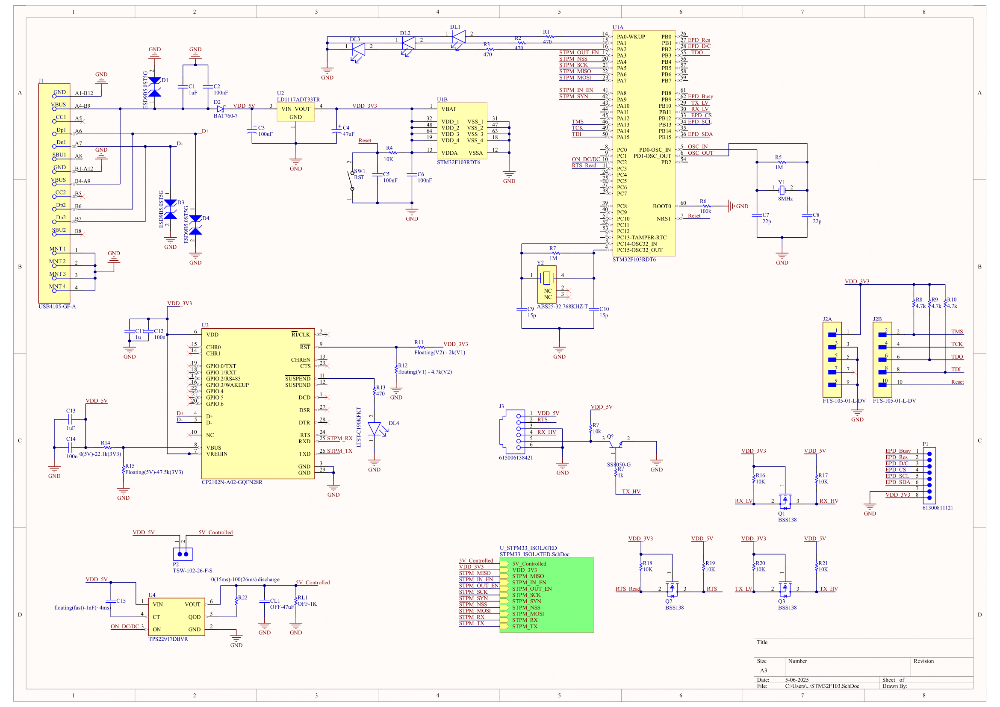

<div align="center">

# Smart‑Energy‑Meter‑P1‑Interface  
*An open‑hardware single‑phase 230 V AC smart‑meter platform with DSMR P1 output*


</div>

---

##  Why this project?

Commercial P1 meters often come as closed “black boxes”.  
This project provides a **fully open‑source**, **calibratable** and **hack‑friendly** reference design that:

* measures **voltage, current, active/apparent/reactive power & energy**  
* streams DSMR‑compatible telegrams over **UART/RJ‑12 (P1)** every 1 s  
* displays live data on a **low‑power e‑paper** screen  
* can be replicated with off‑the‑shelf parts and a 2‑layer PCB  
* is easily re‑programmable (STM32 + C firmware)

---

##  Key features

| Block | Component | Rationale |
|-------|-----------|-----------|
| Energy‑SoC | **STPM33** | ≤0.1 % accuracy, dual Σ‑Δ ADC, SPI, gain/phase calibration |
| Current sensing | **Ring CT 0–50 A** | safe, galvanically isolated, wide dynamic range |
| Voltage sensing | Precision divider + RC anti‑alias filter |
| MCU | **STM32F103** | mainstream Cortex‑M3, plenty of I/O|
| Isolation | **NVE IL710,260,STISO** digital isolators + **TRACO TMV‑HI** 3 kV DC/DC |
| Display | 2.13″ **E‑Ink** (black/white) | zero standby current, daylight readable |
| Comms | P1 UART (115 200 baud) on **RJ‑12** |

---


##  Hardware overview

<p align="center">
  <br>
  <em>Figure 1 – PCB, top side / solder-mask view</em>
</p>

<p align="center">
  <br>
  <em>Figure 2 – PCB, bottom copper / solder‑mask view</em>
</p>

<p align="center">
  <br>
  <em>Figure 3 – Board 3D render</em>
</p>

### Schematics  
| Sheet | Description |
|-------|-------------|
|  | Primary side: mains input, fuse, CT, voltage divider |
|  | Logic side: STM32, display, P1 interface |

---


##  Getting started

### 1 . Clone & build firmware
```bash
git clone https://github.com/NiU848/Smart-Energy-Meter-P1-Interface.git
cd Smart-Energy-Meter-P1-Interface/firmware
